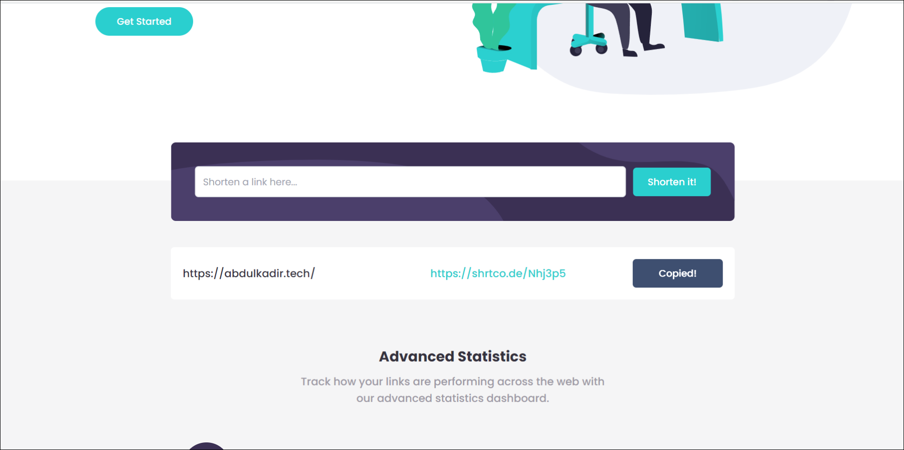

# Shortly

A url shortener built using React.js and Tailwind CSS.
This is a solution to the [Shortly URL shortening API Challenge challenge on Frontend Mentor](https://www.frontendmentor.io/challenges/url-shortening-api-landing-page-2ce3ob-G).
 
 

### Landing page

 
 

### Shortening a url

 
 

### See all shortened urls and copy to clipboard

